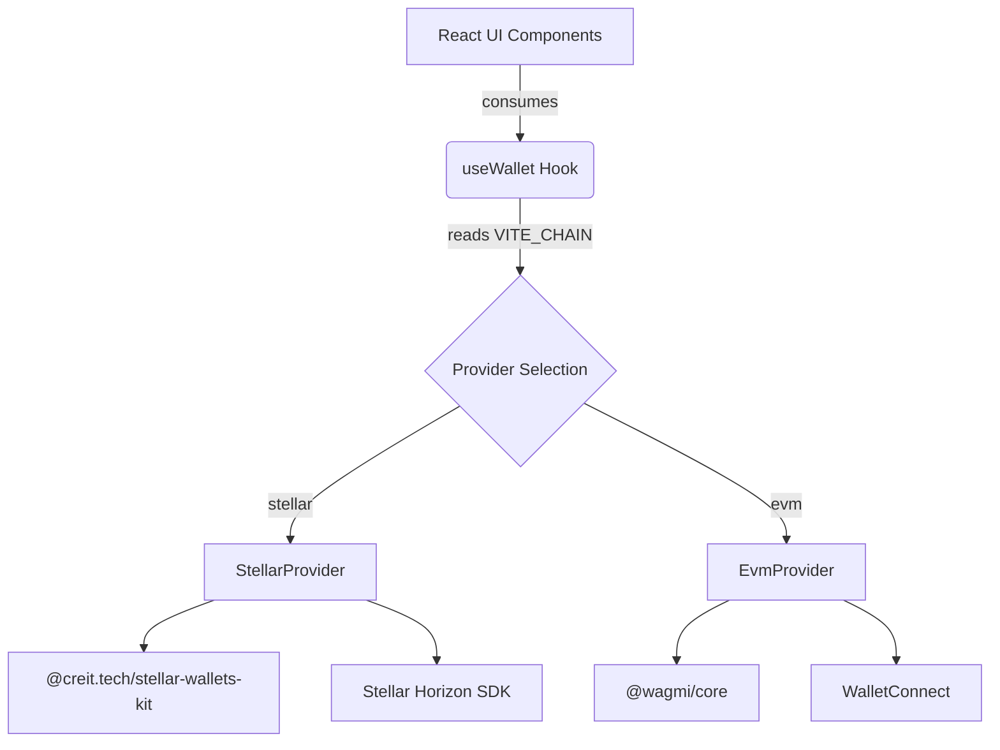

# 🧩 StellarConnect (Multi-Chain Wallet Integration)

[](https://opensource.org/licenses/MIT)
[](https://www.typescriptlang.org/)
[](https://react.dev/)
[](https://stellar.org/)
[](http://makeapullrequest.com)

**StellarConnect** is a modern, lightweight dApp built with React and TypeScript that enables seamless wallet connection across multiple blockchain networks. 

Originally built exclusively for the Base (EVM) ecosystem, this project has been fundamentally architected to support **chain-agnostic wallet connections**, currently prioritizing the **Stellar Network** migration.

## 📖 Motivation

Connecting to disparate blockchains (like EVM vs. Stellar) usually requires entirely different frontend logic, polluting React components with chain-specific SDKs (Wagmi for EVM, Stellar Wallets Kit for Stellar). 

**StellarConnect solves this** by introducing a strict `ChainProvider` interface. Our UI components only consume standard wallet state (`address`, `balance`, `networkLabel`), completely abstracted from the underlying blockchain. This makes the frontend clean, testable, and extremely scalable to new chains.

## 🏗️ Architecture



## ✨ Features

- 🔗 **Chain-Agnostic Interface**: Cleanly swaps between EVM and Stellar configurations without modifying React views.
- 💼 **Smart Address Display**: Automatically detects and formats EVM (`0x...`) and Stellar (`G...`) public keys.
- 💰 **Real-time Balances**: Fetches native XLM or ETH balances natively.
- 🎨 **Premium UI**: Fluid animations powered by Framer Motion & GSAP.

## 🚀 Quick Start

### Prerequisites
- Node.js 20+
- npm or yarn
- A compatible crypto wallet (e.g., Freighter for Stellar, MetaMask for EVM)

### Installation

```bash
# Clone the repository
git clone <repository-url>
cd stellar-connect

# Install dependencies
npm install

# Start development server
npm run dev
```

### Environment Setup

Create a `.env` file in the root directory to toggle the active chain:

```env
# Switch between EVM and Stellar
VITE_CHAIN=stellar # or 'evm' (defaults to evm if omitted)

# Stellar configuration
VITE_STELLAR_NETWORK=testnet # or 'mainnet'

# Base Network RPC (if using EVM)
VITE_BASE_RPC_URL=https://mainnet.base.org
```

## 🤝 Contributing

We welcome contributions from the community! Please read our [Contributing Guidelines](CONTRIBUTING.md) to understand our branching strategy, commit standards, and development process.

Please note that this project is released with a [Contributor Code of Conduct](CODE_OF_CONDUCT.md). By participating in this project you agree to abide by its terms.

## 📄 License

This project is licensed under the MIT License - see the [LICENSE](LICENSE) file for details.
