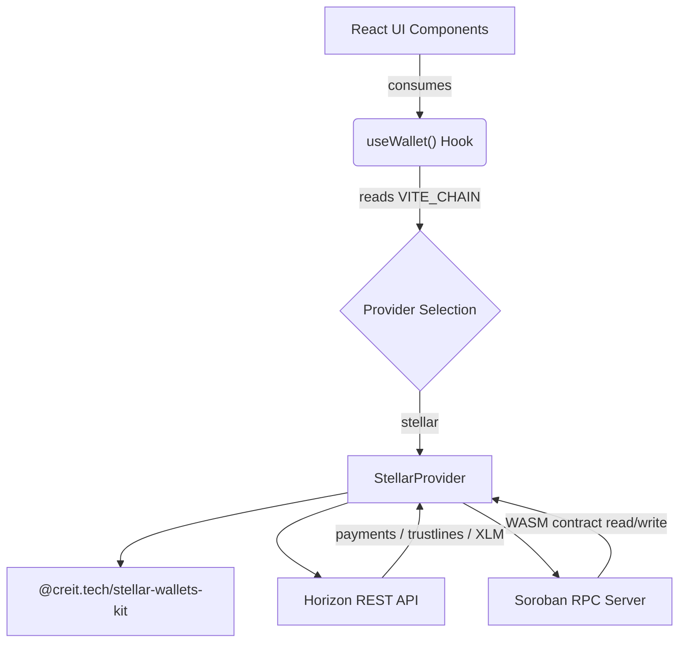

# 🌌 StellarConnect

[](https://opensource.org/licenses/MIT)
[](https://www.typescriptlang.org/)
[](https://react.dev/)
[](https://stellar.org/)
[](https://vitejs.dev/)
[](CONTRIBUTING.md)
[](https://github.com)

**StellarConnect** is a production-ready, chain-agnostic wallet integration dApp built with **React 19** and **TypeScript**. It connects users to the **Stellar Network** through a beautiful, responsive interface that abstracts all blockchain complexity behind a clean provider interface.

> Originally built for the Base (EVM) ecosystem, StellarConnect was fully migrated to Stellar, trimming the bundle from **2.5 MB → 1.02 MB** and replacing EVM-specific tooling with a leaner, purpose-built Stellar stack.

---

## 📸 Preview

> Connect your Stellar wallet (Freighter, xBull, Rabet), view real-time balances, send assets, manage trustlines, claim testnet XLM via Friendbot, and invoke Soroban smart contracts — all in one UI.

---

## ✨ Feature Set

| Feature | Description |
|---|---|
| 🔗 **Multi-Wallet Support** | Connects via Freighter, xBull, and Rabet using the Stellar Wallets Kit |
| 💰 **Real-time Balances** | Fetches native XLM + all custom trustline tokens from Horizon |
| 📤 **Send Transactions** | Builds, signs, and submits Stellar payments for any asset |
| 🪙 **Trustline Manager** | Establishes trustlines for custom Stellar assets (with testnet USDC preset) |
| 📋 **Recent Payments Feed** | Displays last 10 on-chain operations with StellarExpert explorer links |
| 🚰 **Friendbot Faucet** | One-click testnet XLM funding via Stellar's Friendbot API |
| 🤖 **Soroban Smart Contracts** | Reads and increments a counter value on a deployed WASM contract via Soroban RPC |
| 🎨 **Premium UI** | Fluid animations (Framer Motion + GSAP), dark mode, glassmorphism cards |
| 🌐 **Testnet / Mainnet Toggle** | Single env variable switches the entire network stack |

---

## 🏗️ Architecture

StellarConnect is built around a strict `ChainProvider` interface. React components never import chain-specific SDKs — they only interact with `useWallet()`, making the UI fully portable.

```
src/
├── chain/
│   ├── types.ts              # ChainProvider interface + shared types
│   └── stellar/
│       ├── horizon.ts        # Horizon API + Soroban RPC helpers
│       ├── network.ts        # Network passphrase / label constants
│       └── provider.ts       # StellarProvider class (implements ChainProvider)
├── hooks/
│   └── useWallet.ts          # Central hook — connects UI to the active provider
├── components/
│   ├── WalletInfo.tsx         # Main dashboard card
│   ├── Hero.tsx               # Landing section
│   ├── Layout.tsx             # Page shell
│   ├── Features.tsx           # Marketing feature cards
│   ├── ThemeToggle.tsx        # Dark/light mode switcher
│   └── AnimatedBackground.tsx # Particle / bubble background effects
├── contexts/                  # React context providers
├── providers/                 # App-level provider wrappers
├── utils/
│   └── address.ts             # Stellar address validation utility
└── index.css                  # Design tokens + global styles
```

### Data Flow



---

## ⚙️ Tech Stack

| Layer | Technology |
|---|---|
| **Framework** | React 19 + TypeScript 5.9 |
| **Build Tool** | Vite 7 |
| **Stellar SDK** | `@stellar/stellar-sdk` v16 |
| **Wallet Kit** | `@creit.tech/stellar-wallets-kit` v2.5 |
| **Animations** | Framer Motion + GSAP 3 |
| **UI Components** | Geist UI + Lucide Icons |
| **Styling** | Tailwind CSS v4 + custom design tokens |
| **Linting** | ESLint 9 + TypeScript-ESLint |

---

## 🚀 Quick Start

### Prerequisites

- **Node.js** v20 or higher
- **npm** v10 or higher
- A Stellar-compatible browser wallet: [Freighter](https://www.freighter.app/), [xBull](https://xbull.app/), or [Rabet](https://rabet.io/)

### Installation

```bash
# 1. Clone the repository
git clone https://github.com/<your-org>/stellar-connect.git
cd stellar-connect

# 2. Install dependencies
npm install

# 3. Configure environment
cp .env.example .env

# 4. Start the development server
npm run dev
```

Open [http://localhost:5173](http://localhost:5173) in your browser.

---

### Testing

This project uses **Playwright** for end-to-end (E2E) testing.

#### Running Tests
* **Run all E2E tests (headless):**
    ```bash
    npm run e2e
    ```
* **Run E2E tests in UI mode (interactive):**
    ```bash
    npm run e2e:ui
    ```
* **Run E2E tests in headed mode (visible browser):**
    ```bash
    npm run e2e:headed
    ```

#### CI/CD
The project includes a GitHub Actions workflow that automatically runs these tests on every `push` and `pull_request` to `main` and `dev` branches.

## 🔧 Environment Configuration

Create a `.env` file (or copy `.env.example`) in the project root:

```env
# Active blockchain chain (currently only 'stellar' is supported)
VITE_CHAIN=stellar

# Stellar network — 'testnet' for development, 'mainnet' for production
VITE_STELLAR_NETWORK=testnet
```

| Variable | Values | Default | Description |
|---|---|---|---|
| `VITE_CHAIN` | `stellar` | `stellar` | Selects the active `ChainProvider` implementation |
| `VITE_STELLAR_NETWORK` | `testnet` \| `mainnet` | `testnet` | Targets Stellar Testnet or Mainnet Horizon endpoints |

> **Note:** Switching to `mainnet` automatically changes the Horizon endpoint, network passphrase, and Soroban RPC endpoint. Never use a funded mainnet wallet with an untested contract ID.

---

## 📖 Using the App

### 1. Connect Your Wallet
Click **"Connect Wallet"** in the hero section. The Stellar Wallets Kit modal will appear, letting you choose Freighter, xBull, or Rabet.

### 2. View Balances
Once connected, the dashboard displays:
- Your wallet address (with copy + StellarExpert links)
- Native XLM balance
- All custom token balances (established via trustlines)
- Current network label

### 3. Friendbot Faucet (Testnet Only)
Click the **"Friendbot"** button on the balances card to instantly fund your testnet wallet with **10,000 XLM**. The balance auto-refreshes after a 2-second ledger ingestion delay.

### 4. Send Assets
Fill in a recipient Stellar address (`G...`) and an amount. If you hold multiple assets, a dropdown lets you select which to send. Click **"Send Transaction"** and sign in your wallet.

### 5. Add Custom Token (Trustlines)
Enter an **Asset Code** (e.g., `USDC`) and **Issuer Address**, then click **"Establish Trustline"**. Use the quick-fill **"+ USDC (Testnet)"** preset to avoid manual copy-pasting of issuer addresses.

### 6. Recent Payments
The payments table auto-populates with your last 10 operations:
- 🟢 **Received** — incoming payments (green)
- 🔴 **Sent** — outgoing payments (red)  
- 🟡 **Create Account** — account creation ops (amber)

Each row links directly to StellarExpert for full transaction details.

### 7. Soroban Smart Contract Counter
The **"Soroban WASM Smart Contract Counter"** card lets you interact with an on-chain counter contract:
- **Fetch Value** — Simulates a read-only call to get the current counter integer
- **Increment** — Builds, simulates, signs, submits, and polls a WASM increment transaction

The default Contract ID is pre-populated with a testnet counter contract for immediate demonstration.

---

## 🔌 ChainProvider Interface

All blockchain logic is isolated behind this interface in [`src/chain/types.ts`](src/chain/types.ts):

```typescript
export interface ChainProvider {
  connect(): Promise<{ address: string }>;
  disconnect(): Promise<void>;
  getAddress(): string | null;
  getBalances(address: string): Promise<BalanceInfo[]>;
  getNetworkLabel(): string;
  isConnected(): boolean;
  sendTransaction(to: string, amount: string, assetCode?: string, assetIssuer?: string): Promise<{ hash: string }>;
  getRecentPayments(address: string): Promise<PaymentRecord[]>;
  addTrustline(assetCode: string, assetIssuer: string): Promise<{ hash: string }>;
  fundAccount(address: string): Promise<boolean>;
  getContractValue(contractId: string): Promise<number>;
  incrementContractValue(contractId: string): Promise<{ hash: string }>;
}
```

To add support for a new blockchain (e.g., Solana), create a new class that implements this interface and swap it in via the `VITE_CHAIN` environment variable. No UI changes required.

---

## 📜 Available Scripts

```bash
# Start the development server with HMR
npm run dev

# Type-check + build the production bundle
npm run build

# Run ESLint across all source files
npm run lint

# Preview the production build locally
npm run preview
```

---

## 🗂️ Key Files Reference

| File | Purpose |
|---|---|
| [`src/chain/types.ts`](src/chain/types.ts) | `ChainProvider` interface + `BalanceInfo` / `PaymentRecord` types |
| [`src/chain/stellar/provider.ts`](src/chain/stellar/provider.ts) | Full Stellar implementation: connect, balances, payments, trustlines, Soroban |
| [`src/chain/stellar/horizon.ts`](src/chain/stellar/horizon.ts) | Horizon REST client, Friendbot helper, Soroban RPC server instance |
| [`src/chain/stellar/network.ts`](src/chain/stellar/network.ts) | Network constants and passphrase resolution |
| [`src/hooks/useWallet.ts`](src/hooks/useWallet.ts) | Reactive hook exposing all provider actions to UI |
| [`src/components/WalletInfo.tsx`](src/components/WalletInfo.tsx) | Main dashboard component (balances, send, trustlines, Soroban, payments) |
| [`src/utils/address.ts`](src/utils/address.ts) | Stellar `G...` address validation regex |

---

## 🤝 Contributing

We warmly welcome contributions from the community! Please read our full [Contributing Guide](CONTRIBUTING.md) before opening a pull request.

### Quick Contribution Summary

1. **Fork** the repository and clone locally
2. **Branch** using the naming convention:
   - `feat/feature-name` — new features
   - `fix/bug-description` — bug fixes
   - `docs/doc-name` — documentation
   - `refactor/scope` — internal improvements
3. **Commit** following [Conventional Commits](https://www.conventionalcommits.org/):
   ```
   feat: add soroban contract read support
   fix(ui): correct overflow on mobile wallet card
   docs: update environment setup instructions
   ```
4. Ensure `npm run lint` and `npm run build` pass cleanly
5. Open a **Pull Request** against the `dev` branch and fill out the PR template

### Good First Issues

- Adding support for a new Stellar wallet (e.g., Lobstr, Solar)
- Improving error messages and UX for failed transactions
- Adding unit tests for the `useWallet` hook
- Writing E2E tests with Playwright

---

## 🛡️ Security

- Never commit `.env` or `.env.local` files — they are gitignored by default
- All transaction signing happens **inside your wallet extension** — private keys never touch the app
- The Soroban RPC endpoint is public testnet only; production deployments should use an authenticated RPC provider
- Please report security vulnerabilities privately to the maintainers rather than opening a public issue

---

## 📄 License

This project is licensed under the **MIT License** — see the [LICENSE](LICENSE) file for full details.

---

## 🙏 Acknowledgements

- [Stellar Development Foundation](https://stellar.org/) for the incredible open-source tooling
- [Creit Technologies](https://creit.tech/) for the Stellar Wallets Kit
- [Geist UI](https://geist-ui.dev/) for the clean component library
- The open-source community for continuous inspiration and feedback
